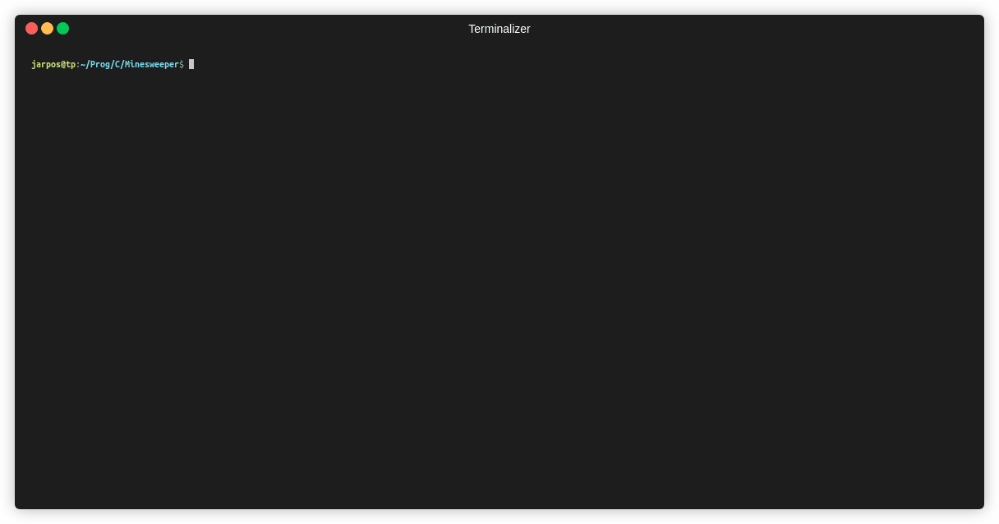

# Basic CLI Minesweeper
...that I <s>will probably never properly finish</s> pretty much finished...

## Quick little HowTo


<br>

**NAQ** (Never Asked Questions)**:**<br>
_Why?_<br>
Because I wanted to do something in C and this seemed simple enough<br>
<br>

_Why not use a graphic library like ncurses?_<br>
Because I did not want to<br>
<br>

_Why do you cast your mallocs?_<br>
Modern C compilers usually don't care, but C++ compilers do and I
don't really want to deal with CMake choosing a C++ compiler and throwing
errors<br>
<br>

**Todo** (After most basic stuff is finished)**:**<br>
 - [ ] Generate fields until valid input is found for first input
 - [ ] Clear adjacent fields if selected field has no adjacent bombs
 - [X] Add row/column numbers to cli output
 - [X] Game output should work on fields larger than 10x10
 - [X] Add flags for marking
 - [X] Rework how cells are selected
 - [X] Disable *all* VT100 Terminal codes when selected

### Build
**Dependencies:**<br>
No external dependencies apart from the C99 standard library
and libm (C Standard Math library)<br>
<br>

**Building:**<br>
```sh
sh build.sh
```
or
```sh
cd build
cmake ..
make
```


### File Layout
```
jarm
├── build.sh        // Quick & dirty Linux build script
├── CMakeLists.txt  // Quick & probably dirty CMake build script
├── LICENSE         // MIT License
├── README.md       // this
└── src
    ├── main.c    // Main programm
    ├── config.h  // Build configuration macros
    ├── cli
    │   ├── Cli.c  // Command line interface interactions implementations
    │   └── Cli.h  // "                                 " declarations
    └── logic
        ├── GameLogic.c  // Game interactions/logic implementations
        └── GameLogic.h  // "                     " declarations
```


### How the code does its thing
**Internal state meaning:**<br>
Num | Meaning
:-: | ----
 0  | Nothing
 1  | Bomb
 2  | Checked by Player

<br>

**Board internal state:**<br>
  \\  |  0  |  1  |  2
:---: | :-: | :-: | :-:
**0** |  0  |  1  |  1
**1** |  0  |  2  |  0
**2** |  1  |  1  |  2

<br>

**Board as shown to player:**<br>
  \\  |  0  |  1  |  2
:---: | :-: | :-: | :-:
**0** |  ?  |  ?  |  ?
**1** |  ?  |  4  |  ?
**2** |  ?  |  ?  |  1

<br>

**Written explanation:**<br>
The game board (grid) in the `Board_t` is of
type `uint16_t*[]` or `uint16_t**` and is
dynamically allocated by creating it through
`msw_Init`. <br>
The initialised board can then be used to play
the game with other `msw_*` function. <br>
I/O is done through the `cli_*` functions.


**Gameplay loop with "pseudo code":**<br>
```
Parse command line arguments
Initialise variables and game board

Do until game is not ongoing
    Print the gameboard
    Get command input
    Update game with command inputs
    Update game status (is ongoing etc.)

Give user feedback about win/loss
Free heap allocated memory if needed
```

